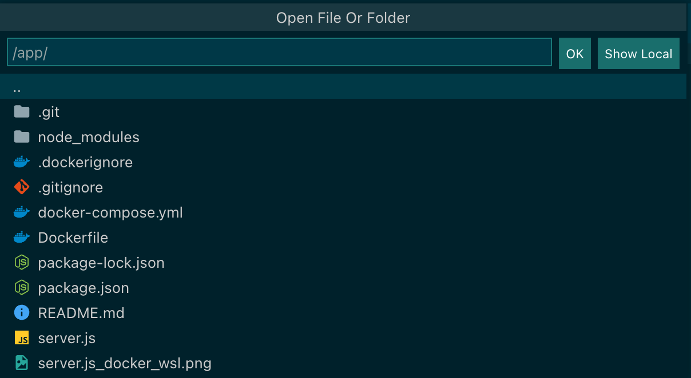
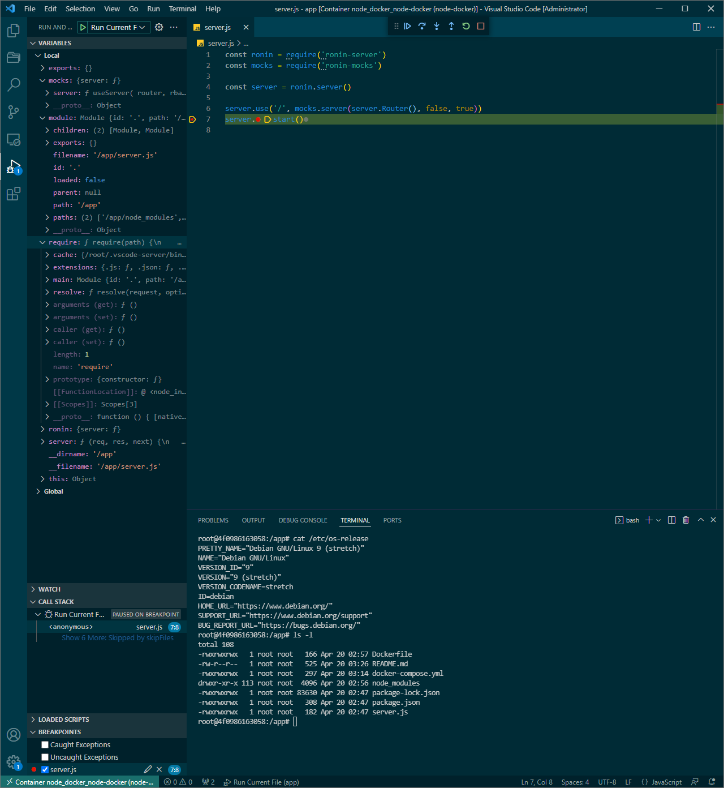

# node-docker

**Table of Contents**
* [node-docker](#node-docker)
  * [Usage](#usage)
  * [Further reading](#further-reading)

## Usage
* Start the Node.js app in Docker
    ```bash
    # build the image
    docker-compose build

    # start the container in detached mode
    docker-compose up -d

    # tail the last 50 lines of logs
    docker-compose logs -tf --tail="50" node-docker
    ```
* Send a command
    ```bash
    curl --request POST --url http://localhost:8000/test --header 'content-type: application/json' --data '{"msg": "testing" }'
    ```
* Debug in VSCode
* Select the Docker extension on the left-hand toolbar
* Under containers, right click the `node_docker_node_docker` (awkward, I know) container
  * Attach Visual Studio Code > Hit enter to select the same container in the popup menu
* A new VSCode window appears inside of the Docker container root directory
  * Selct Open Folder in Explorer on the left-hand column
  * Choose `/app` as the directory
    
* Select the `server.js` file in Explorer on the left-hand side
* On the status bar at the bottom, select Run Current File
  * Choose `Node.js...`
  * Run Current File
* Set a breakpoint


## Further reading
[Build your Node image | Docker Documentation](https://docs.docker.com/language/nodejs/build-images/)

[Build and run a Node.js app in a container](https://code.visualstudio.com/docs/containers/quickstart-node)

[Debug Node.js Apps using Visual Studio Code](https://code.visualstudio.com/docs/nodejs/nodejs-debugging)

[Docker Node.js Example](https://gist.github.com/remarkablemark/a877f2d78bfac0e9aca003c99df137ee)
